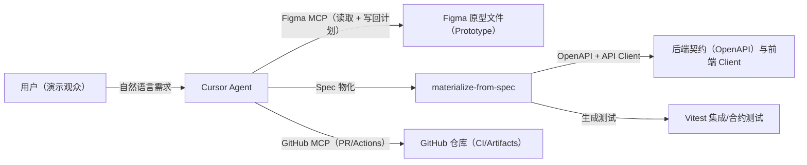

# demo-login-20260402-001 架构 C4（Mermaid + Excalidraw 可编辑图引用）

## Mermaid C4

```mermaid
%% C4Context / C4Container / C4Component（按本项目演示链路抽象）
flowchart LR
  U[用户（演示观众）] -->|自然语言需求| A[Cursor Agent]
  A -->|Figma MCP（读取 + 写回计划）| F[Figma 原型文件（Prototype）]
  A -->|Spec 物化| M[materialize-from-spec]
  M -->|OpenAPI + API Client| B[后端契约（OpenAPI）与前端 Client]
  M -->|生成测试| T[Vitest 集成/合约测试]
  A -->|GitHub MCP（PR/Actions）| G[GitHub 仓库（CI/Artifacts）]
```

## Excalidraw 可编辑图

导入并继续编辑的文件路径：
- `records/demo-login-20260402-001_architecture_c4.excalidraw.json`

